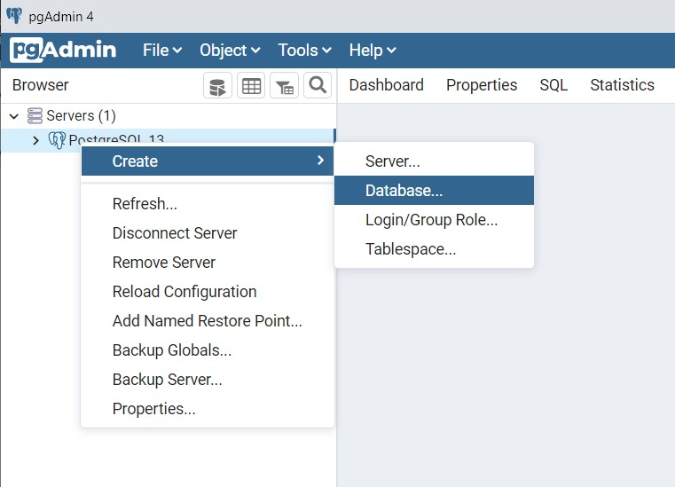

# TinderRecipe
###Project description
This project contains the back end for a handy and useful 
multiplatform application for people who are enthusiastic for cooking,
love sharing and trying new recipes. The mobile application is based
on Tinder app. Users will be able to swipe through the pictures of
recipes, and respectively like or dislike them.
When a recipe is liked, it will be saved in user's favorite recipes, 
and there they can look at it later. 

###Languages and tools
* ***Kotlin*** - *main coding language*
* ***PostgreSQL*** - *the free open-source database that we use*
* ***GraphQL*** - *an open-source data query and manipulation language for APIs*

###Instalition and Set up

1. Download the existing project by cloning the repository.
   (The project is developed in the Java environment -
   **[IntelliJ IDEA](https://www.jetbrains.com/idea/download/#section=windows)**) \
   *Highly recommended is  to use a version **2021 or higher!***
3. Download **[PostgreSQL](https://www.postgresql.org/)**
- *username?*
- *password?*

3. After having PostgreSQL downloaded, create a new database
   called ***library*** with pgAdmin 4.\
   It will be automatically connected with the source code.\
   (*see the steps below on the picture*)

4. To run the project:
    - run the main.kt file in IntelliJ
    - click on this link - [localhost:8080/graphql?access_token=1](localhost:8080/graphql?access_token=1)
    